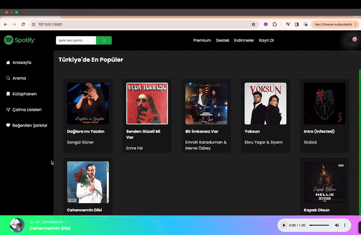

<h1> spotifyClone </h1>

#HTML, SCSS, and JavaScript were used. Rapid API integration was done for Turkey's popular song list.
#Users can search for their desired song or artist. Search results are presented in a user-friendly manner.
#Dark mode and light mode options have been added. Users can customize the appearance according to their preferences. #Animations were added to enhance the user experience in the loading section. A dynamic visual is provided to users while the page is loading.

API: https://rapidapi.com/apidojo/api/shazam/

<h2> The technologies used in the project </h2>

It was coded using;
Html, Scss,JavaScript and RapidAPI.

<h2> Screenshot </h2>

# spotifyClone

